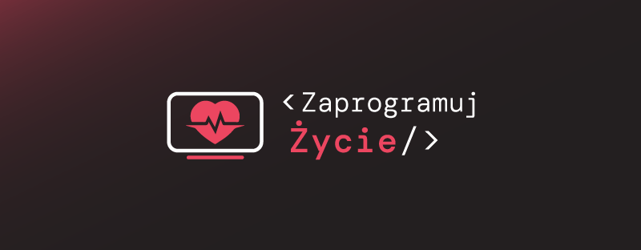
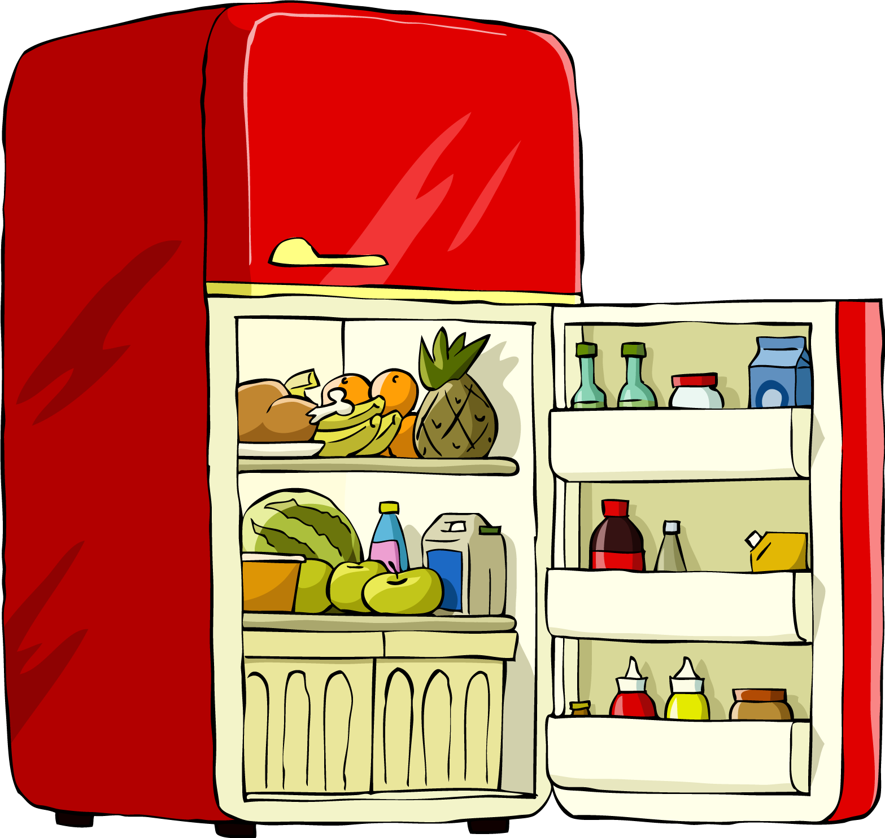
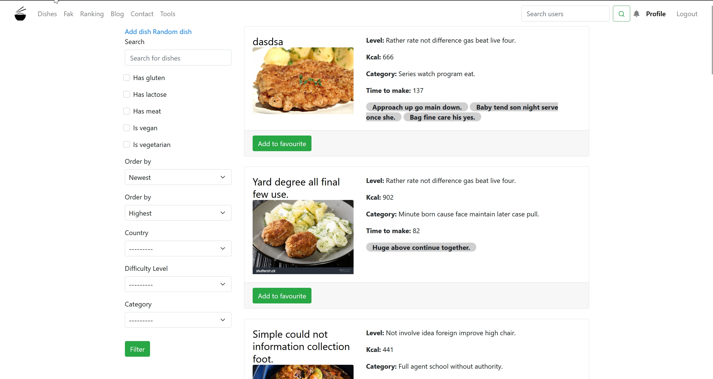
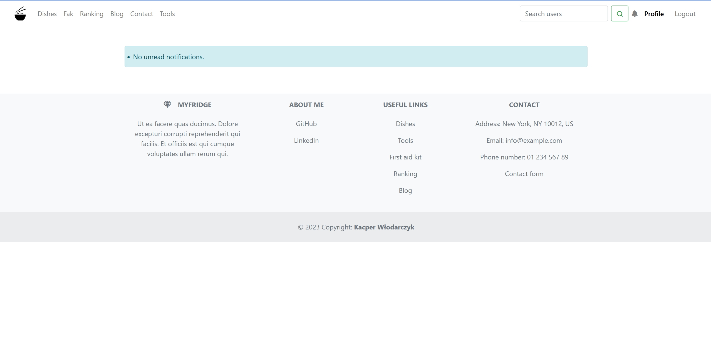
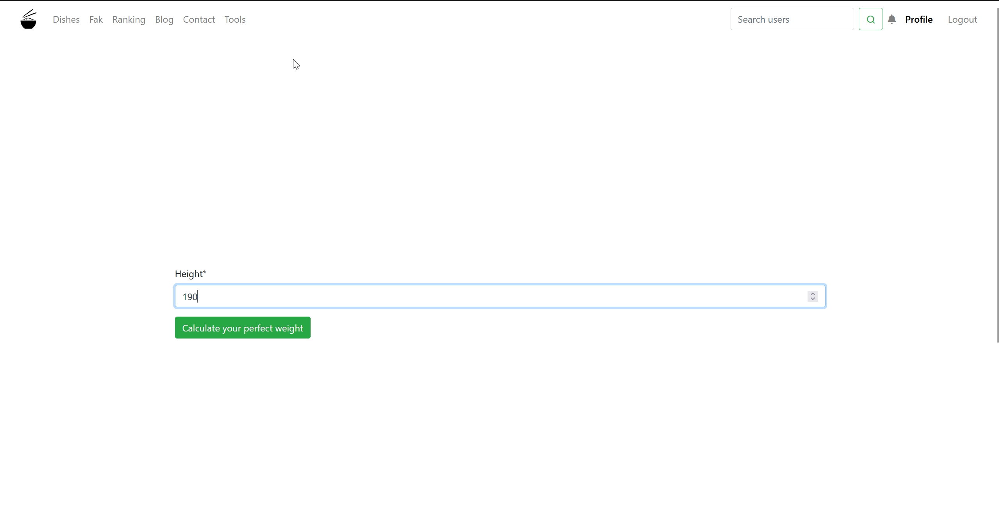
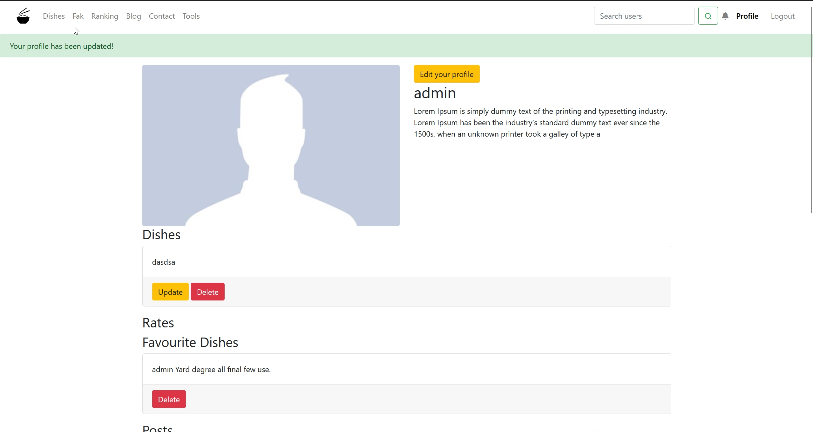
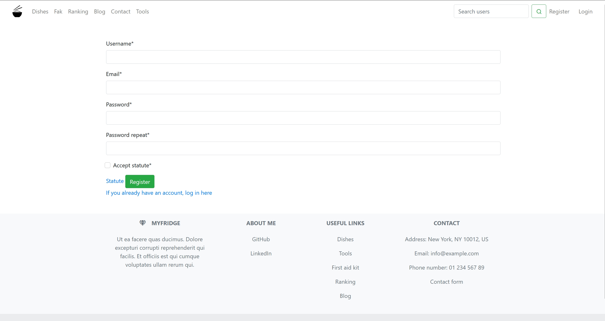
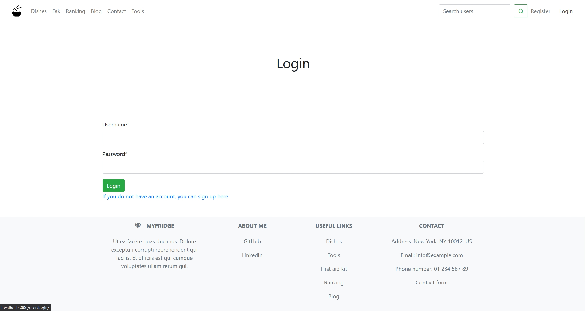

[![Stargazers][stars-shield]][stars-url]
[![Issues][issues-shield]][issues-url]
[![MIT License][license-shield]][license-url]
[![LinkedIn][linkedin-shield]][linkedin-url]


<br />

<div align="center">
  <a href="https://github.com/DEENUU1/">
<br>
<br>
    
  </a>

  <h3 align="center">MyFridge</h3>

  <p align="center">
    Control your health with a few click!
    <br />
    <br />
    <a href="https://github.com/DEENUU1/MyFridge/issues">Report Bug</a>
    ·
    <a href="https://github.com/DEENUU1/MyFridge/issues">Request Feature</a>
  </p>
</div>


<!-- TABLE OF CONTENTS -->

### Table of Contents
  <ol>
    <li>
      <a href="#about-the-project">About The Project</a>
      <ul>
        <li><a href="#built-with">Built With</a></li>
      </ul>
    </li>
    <li><a href="#key-features">Key features</a></li>
    <li>
      <a href="#getting-started">Getting Started</a>
      <ul>
        <li><a href="#installation">Installation</a></li>
        <li><a href="#configuration">Configuration</a></li>
      </ul>
    </li>
    <li><a href="#unit-tests">Tests</a></li>
    <li><a href="#license">License</a></li>
    <li><a href="#author">Author</a></li>
  </ol>

<!-- ABOUT THE PROJECT -->
## About The Project

The project is a Django-based application that allows users to browse various recipes and filter them by date, ingredients, dietary preferences, categories, and more. Additionally, the application features a perfect weight calculator, BMI calculator, and calorie needs calculator. Users can create shopping lists, write blog posts, follow other users, create meal plans, and share them with others. They can create medicine cabinets and add medications, and if a medication's expiration date passes, a notification is sent to the user's email. When browsing a recipe, users can send the required ingredients to their email. Users can register, log in, change passwords, delete accounts, add descriptions, and earn points by adding recipes to favorites or writing comments. There is a user ranking system. Users can add their daily weight statistics and view their analysis. They can also contact the site administrator if they have any questions. Users receive notifications within the application after being followed, receiving a review on their blog post or recipe.
### Built With
- Python
- Django
- HTML, CSS, BOOTSTRAP 5
- Docker
- Redis
- Celery
- Django Celery Beat
- Postgresql
- Sentry
  
## Key Features
- Browse and filter recipes by various criteria (date, ingredients, preferences, categories, etc.)
- Perfect weight calculator, BMI calculator, and calorie needs calculator
- Create and manage shopping lists
- Write blog posts and follow other users
- Create and share meal plans
- Manage medicine cabinets and receive email notifications for expired medications
- Email the ingredients of a recipe to the user
- User registration, login, password management, and account deletion
- Add descriptions and earn points for favorites and comments
- User ranking system
- Track and analyze daily weight statistics
- Contact the site administrator
- Receive notifications for follows and reviews
- Send verification emails (register, password change)




<div style="display: flex;">
  <div style="flex: 1;">
        
  </div>
  <div style="flex: 1;">
        
  </div>
</div>



<div style="display: flex;">
  <div style="flex: 1;">
        
  </div>
  <div style="flex: 1;">
        
  </div>
</div>






<!-- GETTING STARTED -->
## Getting Started

### Installation


First, you need to clone this repository
```bash
git clone <link>
```

### Configuration
```bash
# Create .env file based on .env_example
cp .env_example .env

# Build local docker images
docker-compose -f docker-compose.dev.yml build

# Run app
docker-compose -f docker-compose.dev.yml up

# Enter bash in django container
docker exec -it myfridge-web-dev bash

# Inside container run this commands
python manage.py makemigrations
python manage.py migrate

# Restart / Run again all containers
# If app doesn't work you need to restart myfridge-web-dev container 
docker restart myfridge-web-dev
```

### Tests
```bash
# Enter bash in django container 
docker exec -it myfridge-web-dev bash

# Run pytests
pytest 
```

### Load fake data
```bash
# Enter bash in django container
# Create fake data for models: User, DifficultyLevel
# DishCategory, MainIngredients, OtherIngredients, TimeToMake, 
# Types, Fak, Feedback, MealDailyPlan, Meal, ShoppingList

python manage.py loaddata
```


<!-- LICENSE -->
## License

Distributed under the MIT License. See `LICENSE.txt` for more information.


## Author

- [@DEENUU1](https://www.github.com/DEENUU1)


<!-- MARKDOWN LINKS & IMAGES -->
<!-- https://www.markdownguide.org/basic-syntax/#reference-style-links -->
[contributors-shield]: https://img.shields.io/github/contributors/DEENUU1/Myfridge.svg?style=for-the-badge
[contributors-url]: https://github.com/DEENUU1/Myfridge/graphs/contributors
[forks-shield]: https://img.shields.io/github/forks/DEENUU1/Myfridge.svg?style=for-the-badge
[forks-url]: https://github.com/DEENUU1/Myfridge/network/members
[stars-shield]: https://img.shields.io/github/stars/DEENUU1/Myfridge.svg?style=for-the-badge
[stars-url]: https://github.com/DEENUU1/Myfridge/stargazers
[issues-shield]: https://img.shields.io/github/issues/DEENUU1/Myfridge.svg?style=for-the-badge
[issues-url]: https://github.com/DEENUU1/Myfridge/issues
[license-shield]: https://img.shields.io/github/license/DEENUU1/Myfridge.svg?style=for-the-badge
[license-url]: https://github.com/DEENUU1/Myfridge/blob/main/LICENSE
[linkedin-shield]: https://img.shields.io/badge/-LinkedIn-black.svg?style=for-the-badge&logo=linkedin&colorB=555
[linkedin-url]: https://www.linkedin.com/in/kacper-wlodarczyk/
